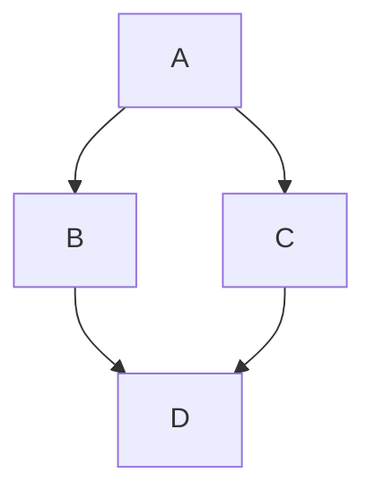
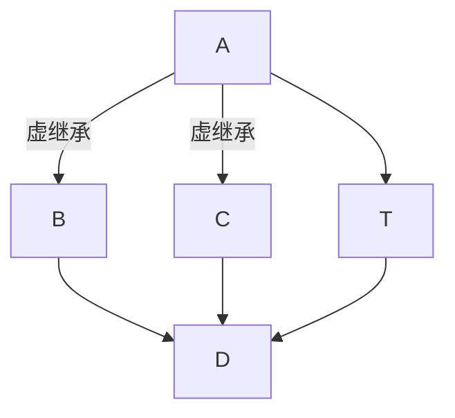

## New \[0\]

在C++中，`int *p = new int[0];`是合法的，但需要注意：

​1. ​返回的指针非空​​：

根据C++标准（如C++11及之后），new分配大小为0的数组会返回一个​​非空指针​​（不等于nullptr）

该指针指向一个零大小的内存块，但​​不能解引用​​（如 `*p` 或 `p[0]`）如果使用了这样的指针会触发 UB。​​某些旧编译器或平台可能返回 nullptr（不符合现代 C++标准），需检查编译器文档。

为什么返回非空？意图是什么？减轻了创建和销毁时特别判断的麻烦？但是 `delete nullptr;` 没有问题啊……

​2. ​必须正确释放​​：

必须使用`delete[] p;`释放内存。未释放会导致内存泄漏。虽然分配大小为0，但释放仍必要，因为分配器可能记录元数据。

## PImpt

C++ 的 **PImpl（Pointer to Implementation）设计模式**  
是一种将类的实现细节隐藏在单独实现类中的技术，常用于**减少编译依赖、加快编译速度、隐藏实现细节**。

- 将类的**私有成员变量和实现细节**放到一个单独的 `Impl` 结构体或类中。
- 在主类中只保留一个指向 `Impl` 的指针（通常是 `std::unique_ptr` 或 `std::shared_ptr`）。
- 用户只看到头文件中的接口，而看不到实现细节。

```cpp
// MyClass.h
#ifndef MYCLASS_H
#define MYCLASS_H
#include <memory>
#include <string>
class MyClass {
public:
    MyClass();
    ~MyClass(); // 必须在 .cpp 中定义析构函数
    void setName(const std::string& name);
    std::string getName() const;
private:
    class Impl; // 前向声明实现类
    std::unique_ptr<Impl> pImpl; 
};
#endif
```

```cpp
// MyClass.cpp
#include "MyClass.h"
#include <iostream>
class MyClass::Impl {
public:
    std::string name;
    void printDebug() const {
        std::cout << "[Debug] name = " << name << "\n";
    }
};

MyClass::MyClass() : pImpl(std::make_unique<Impl>()) {}
MyClass::~MyClass() = default;
void MyClass::setName(const std::string& name) {
    pImpl->name = name;
    pImpl->printDebug();
}
std::string MyClass::getName() const {
    return pImpl->name;
}
```

```cpp
// main.cpp
#include "MyClass.h"
#include <iostream>  
int main() {
    MyClass obj;
    obj.setName("PImpl Example");
    std::cout << "Name: " << obj.getName() << "\n";
    return 0;
}
```

---

### 优点

1. **隐藏实现细节**：头文件不暴露私有成员，减少外部依赖。
2. **减少编译时间**：修改实现类不会导致依赖头文件的代码重新编译。
3. **二进制兼容性**：接口不变时，内部实现可替换而不影响 ABI。

### 缺点

- **多一次指针间接访问**（轻微性能开销）。
- **代码复杂度增加**（需要额外的 Impl 类和内存管理）。
- **移动/拷贝语义**需要显式实现（否则默认删除）。


## 花括号初始化指针

`nvinfer1::IRuntime* runtime {};` 这里用花括号默认初始化指针，会得到空指针，相当于 nullptr。

## 虚继承



菱形继承，如果希望 D 调用 B 的方法时修改 B 的字段，D 调用 C 的方法时修改 C 的字段，独立不共用，重名还需要特别指明 B 或者 C，则这时应该选择非虚继承。不过此时就无法使用 A 的方法修改 A 的字段了，也不可能有 D* 转 A* 的转型，因为会有歧义；除非指定了是 `B::A` 还是 `C::A`



虚继承的目的是让某个类做出声明，承诺愿意共享它的基类。被共享的基类就称为虚基类，派生类通过指针引用虚基类的数据，而不是直接存储多份。这里的结构叫***虚基类表***。

虚基类的初始化由最终派生类负责，直接基类无法初始化虚基类。如图，这里应该是存两份 A。

Q：为啥 tmd 虚继承要设计一个表引入多余开销?？这个虚基类表感觉没啥用啊……

A：由于最终对象布局直到派生完成才确定，编译时“写死”虚基类访问的偏移计算过于复杂（因为对于每个新的派生类都要算一次，最差情况下这种计算还可能会回溯到派生树根，时间爆炸）而虚基类表可以在任何继承复杂度下动态定位唯一虚基类实例，不需要回溯，直接就是 `O(1)`。

## GDB

```bash
gdb path/to/elf_file
target remote localhost:1234

# 打断点
b main.cpp:88
b *0x000000000001149
b *main

tui layout split
focus cmd
display <expression>
info registers

r -- run
s -- step -- 单步到下一个源代码行
si -- stepi -- 单步一条指令
n -- next -- 单步到下一个源代码行，但是不进入函数
ni -- nexti -- 单步一条指令，不进入函数

# 在vscode里 
-exec b main.cpp:88


```

## 传参懒得写左右？

```cpp
#include <iostream>

struct A {
    A() = default;
    A(const A&) {
        std::cout << "copy construct T\n";
    }
    A(A&&) {
        std::cout << "move construct T\n";
    }
};

struct B {
    A path_;
    // B(A path) : path_(std::move(path)) {}
    B(const A& path) : path_(path) {} // 1
    B(A&& path) noexcept : path_(std::move(path)) {} // 2
};

int main(){
    A s;
    B b{s};
    B c{std::move(s)};
}
```

传统上，我们会写两种函数，以便左值正确去 1 右值正确去 2。但是我很懒，想只写一个。

如注释，但其实这是不推荐的，会比传统写法多一次移动，并且还削弱了 `noexcept` 保证。

不过如果从优化的角度讲，有 default 简易移动构造的类型，似乎是可以被编译器优化，从而少掉这次移动的。只不过，为了方便他人交流，以及语义明确，不推荐这样写就是了。

> [!important] 错误的写法
> 不能只写一个 `B(const A&);` 除非你就是想左右值都复制一次。

最近又看到一个写法，就是完美转发：

```cpp
struct B {
    A path_;
    template<typename T>
    B(T&& path) : path_(std::forward<T>(t)) {}
};
```

这种情况下可以用一个自制的“转发”。但是封装成函数就必须像标准库一样写。

```cpp
template<typename T>
B(T&& path) : path_(static_cast<decltype(t)>(t)) {}
```

## 类型转换

```cpp
class Path {
	// 转换构造函数。意思是可以从 basic_string -> Path
	// 如果加了 explicit 则必须显式指明转换，不能隐式转换
	Path(const std::basic_string&) {
		
	}
	
	// 允许 Path -> basic_string 的转换
	explicit operator std::basic_string() const {
	
	}
}
```


## 类型推导

https://azjf.github.io/cpp_type_deduction.html

Effective Modern C++ Chapter 1: Deducing Types