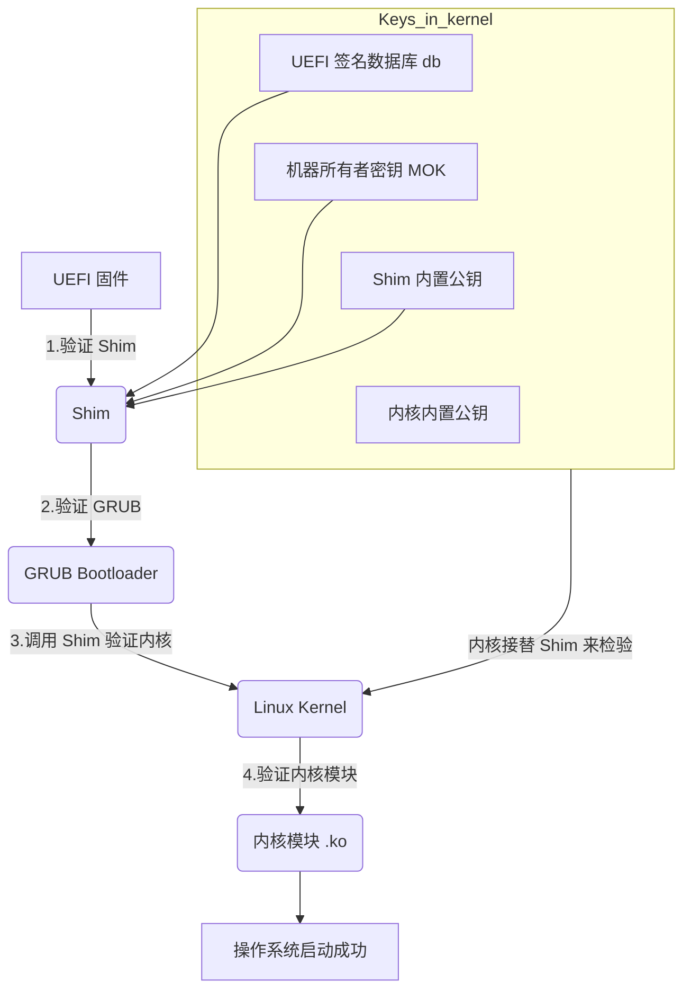
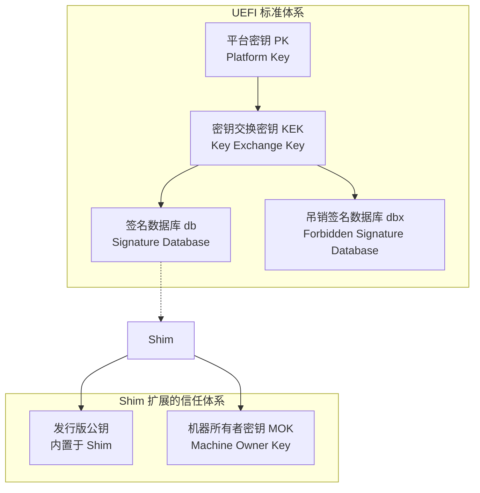

## Background

最近因为使用 ROS 2 需要换到 Ubuntu 22.04，我将其安装至另一块 SSD 中。令我惊喜的是，Ubuntu 的安全启动（Secure Boot）是开箱即用的，这让我在 Windows 和 Ubuntu 双系统间切换时，无需频繁进入 BIOS 启停该功能。

然而，一个问题随之而来：任何 Linux 发行版（包括 LiveCD）在我的天选 Air 笔记本上启动时间都格外长。经过一番搜索，最终定位到是 ACPI 的 DSDT 表存在兼容性问题。解决方案是手动提供一个覆写的 DSDT 表（`.aml` 文件）来跳过有问题的硬件初始化。

在我成功编译并应用自定义 DSDT 表后，安全启动不开心了。因为修改 DSDT 表破坏了启动信任链，内核在 Lockdown 模式下拒绝加载任何未经官方签名的 ACPI 表。这引导我走上了一条深入探索 Linux 安全启动机制的道路。

## Linux 安全启动的核心流程

安全启动并非一个单一的功能，而是一条从硬件加电到操作系统完全加载的**信任链**。在典型的 Linux 发行版中，这条链条是这样构成的：

**UEFI 固件 -> Shim -> GRUB -> Linux 内核 -> 内核模块**

> [!note] Shim 是什么？
> UEFI 固件的信任根是内置于其中的平台密钥（PK）和密钥交换密钥（KEK），并最终信任一个包含公钥的签名数据库（db）。默认情况下，`db` 中通常只包含微软和 OEM 厂商的公钥。
>
> 为了让开源社区的软件（如 GRUB）也能被信任，Shim 项目应运而生。Shim 是一个由微软签名的、轻量级的 EFI 应用程序。它本身可以通过 UEFI 的验证，然后由它来负责验证下一阶段的引导加载程序（如 GRUB 和内核）最终由内核接力负责检验工作，将信任链扩展下去。

下面是整个启动流程的图解：

### 1. 密钥体系：信任从何而来

安全启动的信任基础是一套非对称加密的密钥体系，主要存储在主板的 NVRAM 中。

*   **PK (Platform Key):** 平台所有者（通常是 OEM 厂商）的公钥，用于管理 KEK。
*   **KEK (Key Exchange Key):** 密钥交换密钥，用于更新 `db` 和 `dbx`。微软的 KEK 通常预装在其中。
*   **db (Signature Database):** 包含可信引导加载程序和驱动程序的公钥或哈希值。由微软签名的 Shim 就是被这里的公钥所信任。
*   **MOK (Machine Owner Key):** 这是 Shim 引入的概念。由于 `db` 库普通用户难以修改，Shim 允许用户导入自己的公钥，即 MOK。这些 MOK 被保存在 NVRAM 中，用于验证非官方签名的引导加载程序、内核或驱动（例如 NVIDIA 驱动）。

> [!warning]
> **重要提示：** PK, KEK, db, dbx 和 MOK 都存储在 NVRAM 中。**刷写或重置 BIOS/UEFI 固件极有可能导致这些密钥丢失或恢复出厂设置**。如果导入过自定义的 MOK，之后需要重新导入。

使用 `mokutil --import my_key.der` 即可将自己的公钥导入。首次重启时，一个蓝色的 MOK 管理界面（MokManager）会出现，引导你完成注册流程。

### 2. 内核的角色：Lockdown 模式

当内核检测到系统在安全启动模式下引导时，它会自动启用一个名为 **Lockdown** 的安全特性。

Lockdown 模式旨在**限制 root 用户**的能力，防止即使用户空间被完全攻破（获得 root 权限），攻击者也无法通过修改正在运行的内核来持久化、隐藏或进一步破坏系统。

在 Lockdown 模式下，许多强大的、但可能被滥用的功能会被禁止，包括：
*   **覆写 ACPI 表（我的 DSDT 问题根源）。**
*   加载未签名的内核模块。
*   通过 `/dev/mem` 或 `/dev/kmem` 对内核内存进行读写。
*   修改 MSR 寄存器。
*   kexec 启动一个未签名的内核。

这正是我面临的困境：为了修复启动慢的问题，我需要覆写 DSDT；但为了系统安全，内核在 Lockdown 模式下禁止了这一操作。

## 实践：打造一个自定义且受信任的内核

唯一的出路是：编译一个自定义内核，让它加载我的 DSDT，然后用我自己的 MOK 签名，让整个信任链重新闭合。

### 1. 内核编译与定制

我下载了内核源码，并注释掉了 ACPI 部分拒绝覆写的代码。编译后，我得到了一个 `vmlinuz` 内核镜像。当我尝试用它启动时，系统理所当然地失败了，因为 Grub 调用 Shim 发现它的签名无效。

### 2. 为内核和模块签名

我使用自己的 MOK 密钥对内核镜像进行签名：
`sbsign --key MOK.priv --cert MOK.pem /boot/vmlinuz-custom --output /boot/vmlinuz-custom-signed`

再次启动，内核成功加载了！但很快系统就崩溃了，因为大量的驱动（如文件系统、网络）都无法加载。原因很简单：我只签名了内核**镜像本身**，但编译过程中生成的**内核模块 (`.ko` 文件) 都没有签名**。内核在 Lockdown 模式下同样会拒绝加载它们。

正确的做法是在内核编译配置中指定签名密钥：

1.  进入内核源码目录，运行 `make menuconfig`。
2.  在 `Cryptographic API > Certificates for signature checking` 中：
    *   将 `CONFIG_MODULE_SIG_KEY` 的值设置为你的私钥路径（例如 `certs/signing_key.pem`）。
    * （可选但推荐）将 `CONFIG_SYSTEM_TRUSTED_KEYS` 的值设置为你的公钥路径，这样你的 MOK 就会被直接编译进内核的 `.system_keyring` 中。
3.  将你的私钥 `MOK.priv` 和公钥 `MOK.pem` 复制到指定位置。
4.  重新执行 `make && make modules_install && make install`。

这次，编译系统会自动为每一个内核模块进行签名。最终，我拥有了一个完全由我自己的密钥签名、能够加载自定义 DSDT、并能在安全启动模式下完美运行的系统。

> [!tip] 别忘了 DKMS！
> 上述方法解决了内核**树内模块**的签名问题。但对于 NVIDIA 驱动、VirtualBox 驱动这类通过 `dkms` 管理的**树外模块**，也需要签名。当你正确配置好 MOK 后，`dkms` 会在每次构建模块时自动使用 MOK 密钥进行签名，整个过程无缝衔接。这正是 `mokutil` 最常见的用途之一。

## 结论

Linux 的安全启动是一个设计精妙但略显复杂的系统。通过 Shim 和 MOK，它在安全性和灵活性之间取得了很好的平衡。虽然对于普通用户来说几乎是透明的，但对于需要深度定制系统的开发者和爱好者而言，理解其工作原理、学会如何创建和使用自己的 MOK，是解决各种疑难杂症（如驱动签名、内核定制）的关键技能。

## Ref links

https://bbs.archlinux.org/viewtopic.php?id=307251

https://www.bilibili.com/opus/1104887054270988297

https://forum.archlinuxcn.org/t/topic/14964

内核编译安装：
https://blog.csdn.net/qq_41596356/article/details/131458328